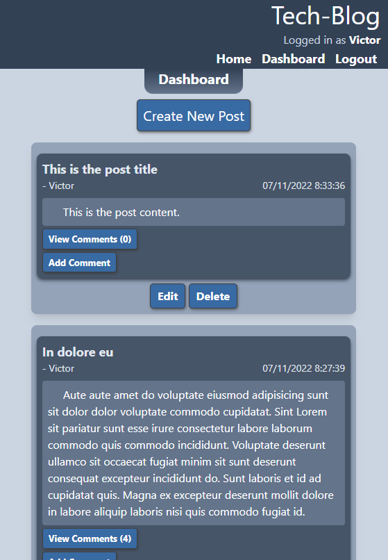

# Tech-Blog

## Description
A blog site, where developers can publish their blog posts and comment on other developers’ posts as well. Using Handlebars.js as the templating language, Sequelize as the ORM, and the express-session npm package for authentication.

## Table of Contents
* [Usage](#usage)
* [Example](#example)
* [Contributing](#contributing)
* [License](#license)
* [Questions](#questions)

## Usage
Upon visiting the site, the homepage will list blog posts from all users, ordered by most recent post creation date. You will have the option to log in (and sign up for an account if you don't have one yet). After logging in, you will be redirected to your dashboard, where you can see all of the posts that you've made, aswell as create a new post. Logged in users will also have the ability to leave comments on other users' posts. Your login session will persist between page visits, and be automatically terminated after 2 hours.

## Example
[Deployed Website](https://tech-blog-victor.herokuapp.com)

## Contributing
Contributions are welcome, contact info is below.

## License
The Tech-Blog project is under the [MIT License](http://choosealicense.com/licenses/mit/). See the link for more details.

## Questions
GitHub: [vicdotexe](https://www.github.com/vicdotexe)

E-mail: [vicdotexe@gmail.com](mailto:vicdotexe@gmail.com)